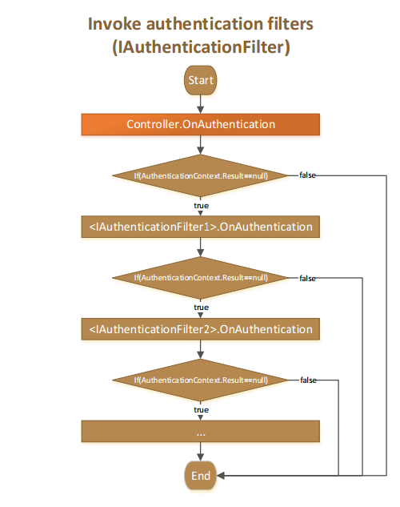
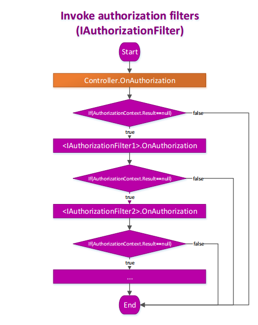
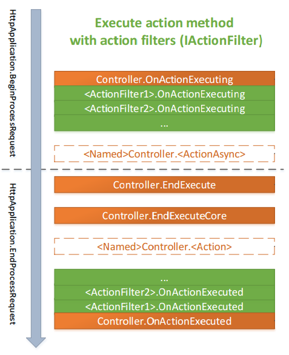
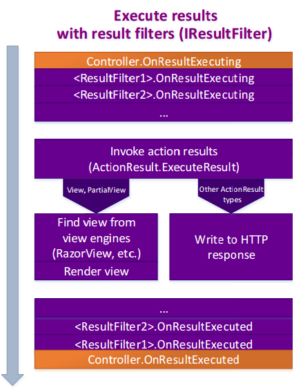

### Built-In (default) Action Invoker

#### Built-In ControllerActionInvoker

__ControllerActionInvoker__ is the basic (legacy) implementation for `IActionInvoker` in Asp.Net.Mvc framework.

``` csharp
namespace System.Web.Mvc
{
    public class ControllerActionInvoker : IActionInvoker
    {
        // ... other stuff
        
        public virtual bool InvokeAction(ControllerContext controllerContext, 
                                         string actionName)
        { ... }
    }
}
```

#### Built-In AsyncControllerActionInvoker

__Controller__ supports asynchronous operations by default, so __AsyncControllerActionInvoker__ is the current default implementation for `IActionInvoker`. This implementation is used by default when no custom invokers or invoker-factories are provided.

``` csharp
namespace System.Web.Mvc.Async
{
    public class AsyncControllerActionInvoker : ControllerActionInvoker, IAsyncActionInvoker
    {
        // ... other stuff
        
        public virtual IAsyncResult BeginInvokeAction(ControllerContext controllerContext, 
                                                      string actionName, 
                                                      AsyncCallback callback, 
                                                      object state)
        { ... }
        
        public virtual bool EndInvokeAction(IAsyncResult asyncResult) 
        { ... }
    }
}
```

#### Controller: The 'ActionInvoker' Property

Any provided `IActionInvoker` implementation becomes an infrastructure element of the __Controller__, accessible via the public __ActionInvoker__ property of it.

```csharp
namespace System.Web.Mvc
{
    public abstract class Controller : ControllerBase, ...
    {
        // ... omitted stuff
        
        public IActionInvoker ActionInvoker { get; set; } = CreateActionInvoker();
    }
}
```

#### Controller: The Process of ActionInvoker Instantiation

* Any provided implementation of `IActionInvoker` can be set via the public __ActionInvoker__ property.
* The `.CreateActionInvoker()` is the protected virtual method of the `Controller`, so we can easily override it when subclassing our __Controller__ to provide the specific process for action-invoker instantiation.
* The instantiation process makes use of two factory interfaces: `IActionInvokerFactory` and its async mate `IAsyncActionInvokerFactory`. Those factories can be customized in order to create an action invoker for each request. So we can provide our own factories implementations.
* For those cases when there are no factories provided, process makes a try to search for custom implementations of `IAsyncActionInvoker` and `IActionInvoker`. Async version is more appropriate.
* Ultimately, the default __AsyncControllerActionInvoker__ is used by the framework if no alternatives were provided.

``` csharp
namespace System.Web.Mvc
{
    public abstract class Controller : ControllerBase, ...
    {
        // ... omitted stuff
        
        protected virtual IActionInvoker CreateActionInvoker()
        {
            IAsyncActionInvokerFactory asyncActionInvokerFactory = 
                Resolver.GetService<IAsyncActionInvokerFactory>();
            
            if (asyncActionInvokerFactory != null)
            {
                return asyncActionInvokerFactory.CreateInstance();
            }
            
            IActionInvokerFactory actionInvokerFactory = 
                Resolver.GetService<IActionInvokerFactory>();
            
            if (actionInvokerFactory != null)
            {
                return actionInvokerFactory.CreateInstance();
            }
            
            return Resolver.GetService<IAsyncActionInvoker>()
                ?? Resolver.GetService<IActionInvoker>() 
                ?? new AsyncControllerActionInvoker();
        }
    }
}
```

#### Controller: Using ActionInvoker

As a recall, let's first see how the `IActionInvoker` is used by the __Controller__:

``` csharp
namespace System.Web.Mvc
{
    public abstract class Controller : ControllerBase, ...
    {
        // ... omitted stuff
        
        public IActionInvoker ActionInvoker { get { ... } set { ... } }
        
        protected override void ExecuteCore()
        {
            // ... omitted stuff
            
            if (!ActionInvoker.InvokeAction(ControllerContext, actionName))
            {
                HandleUnknownAction(actionName);
            }
            
            // ... omitted stuff
        }
    }
}
```

#### ControllerActionInvoker: The Process of .InvokeAction()

For the sake of brevity here we look through the sync version of action-invoke process of the __ControllerActionInvoker__:

``` csharp
public virtual bool InvokeAction(ControllerContext controllerContext, string actionName)
{
    ControllerDescriptor controllerDescriptor = GetControllerDescriptor(controllerContext);
    
    ActionDescriptor actionDescriptor = FindAction(controllerContext, 
                                                   controllerDescriptor,
                                                   actionName);
                                                   
    if (actionDescriptor == null) return false;

    FilterInfo filterInfo = GetFilters(controllerContext, 
                                       actionDescriptor);

    try
    {
        AuthenticationContext authenticationContext = 
            InvokeAuthenticationFilters(controllerContext, 
                                        filterInfo.AuthenticationFilters, 
                                        actionDescriptor);
        
        if (authenticationContext.Result != null)
        {
            /*
             * An authentication filter signalled that we should short-circuit the request.
             * Let all authentication filters contribute to an action result 
             * (to combine authentication challenges). Then, run this action result.
             */
             
            AuthenticationChallengeContext challengeContext = 
                InvokeAuthenticationFiltersChallenge(controllerContext, 
                                                     filterInfo.AuthenticationFilters, 
                                                     actionDescriptor,
                                                     authenticationContext.Result);

            InvokeActionResult(controllerContext, 
                               challengeContext.Result ?? authenticationContext.Result);
        }
        else
        {
            AuthorizationContext authorizationContext = 
                InvokeAuthorizationFilters(controllerContext, 
                                           filterInfo.AuthorizationFilters, 
                                           actionDescriptor);
            
            if (authorizationContext.Result != null)
            {
                /*
                 * An authorization filter signalled that we should short-circuit the request. 
                 * Let all authentication filters contribute to an action result 
                 * (to combine authentication challenges). Then, run this action result.
                 */
                 
                AuthenticationChallengeContext challengeContext = 
                    InvokeAuthenticationFiltersChallenge(controllerContext, 
                                                         filterInfo.AuthenticationFilters, 
                                                         actionDescriptor,
                                                         authorizationContext.Result);
                    
                InvokeActionResult(controllerContext, 
                                   challengeContext.Result ?? authorizationContext.Result);
            }
            else
            {
                if (controllerContext.Controller.ValidateRequest)
                {
                    ValidateRequest(controllerContext);
                }

                IDictionary<string, object> parameters = 
                                            GetParameterValues(controllerContext, 
                                                               actionDescriptor);

                ActionExecutedContext postActionContext = 
                                      InvokeActionMethodWithFilters(controllerContext, 
                                                                    filterInfo.ActionFilters, 
                                                                    actionDescriptor, 
                                                                    parameters);

                /*
                 * The action succeeded. Let all authentication filters contribute to an action result
                 * To combine authentication challenges; some authentication filters need to do negotiation
                 * even on a successful result). Then, run this action result.
                 */

                AuthenticationChallengeContext challengeContext = 
                    InvokeAuthenticationFiltersChallenge(controllerContext, 
                                                         filterInfo.AuthenticationFilters, 
                                                         actionDescriptor,
                                                         postActionContext.Result);
                    
                InvokeActionResultWithFilters(controllerContext, 
                                              filterInfo.ResultFilters,
                                              challengeContext.Result ?? postActionContext.Result);
            }
        }
    }
    catch (Exception ex)
    {
        // something blew up, so execute the exception filters
        ExceptionContext exceptionContext = 
                         InvokeExceptionFilters(controllerContext, 
                                                filterInfo.ExceptionFilters, 
                                                ex);

        if (!exceptionContext.ExceptionHandled)
        {
            throw;
        }
        
        InvokeActionResult(controllerContext, exceptionContext.Result);
    }

    return true;
}
```

#### Step #1: InvokeAuthenticationFilters



The code:

```csharp
protected virtual AuthenticationContext InvokeAuthenticationFilters(ControllerContext controllerContext,
                                                                    IList<IAuthenticationFilter> filters, 
                                                                    ActionDescriptor actionDescriptor)
{
    IPrincipal originalPrincipal = controllerContext.HttpContext.User;
    
    AuthenticationContext context = new AuthenticationContext(controllerContext, 
                                                              actionDescriptor,
                                                              originalPrincipal);
    foreach (IAuthenticationFilter filter in filters)
    {
        filter.OnAuthentication(context);
        // short-circuit evaluation when an error occurs
        if (context.Result != null)
        {
            break;
        }
    }

    IPrincipal newPrincipal = context.Principal;

    if (newPrincipal != originalPrincipal)
    {
        context.HttpContext.User = newPrincipal;
        Thread.CurrentPrincipal = newPrincipal;
    }

    return context;
}
```

#### Step #2: InvokeAuthorizationFilters



The code:

```csharp
protected virtual AuthorizationContext InvokeAuthorizationFilters(ControllerContext controllerContext, 
                                                                  IList<IAuthorizationFilter> filters, 
                                                                  ActionDescriptor actionDescriptor)
{
    AuthorizationContext context = new AuthorizationContext(controllerContext, actionDescriptor);
    
    foreach (IAuthorizationFilter filter in filters)
    {
        filter.OnAuthorization(context);
        // short-circuit evaluation when an error occurs
        if (context.Result != null)
        {
            break;
        }
    }

    return context;
}
```

#### Step #3: Model Binding Process

```csharp

protected virtual IDictionary<string, object> GetParameterValues(ControllerContext controllerContext, 
                                                                 ActionDescriptor actionDescriptor)
{
    Dictionary<string, object> parametersDict = 
        new Dictionary<string, object>(StringComparer.OrdinalIgnoreCase);
    
    ParameterDescriptor[] parameterDescriptors = actionDescriptor.GetParameters();

    foreach (ParameterDescriptor parameterDescriptor in parameterDescriptors)
    {
        parametersDict[parameterDescriptor.ParameterName] = 
            GetParameterValue(controllerContext, parameterDescriptor);
    }
    
    return parametersDict;
}

protected virtual object GetParameterValue(ControllerContext controllerContext, 
                                           ParameterDescriptor parameterDescriptor)
{
    // collect all of the necessary binding properties
    Type parameterType = parameterDescriptor.ParameterType;
    IModelBinder binder = GetModelBinder(parameterDescriptor);
    IValueProvider valueProvider = controllerContext.Controller.ValueProvider;
    string parameterName = parameterDescriptor.BindingInfo.Prefix ?? parameterDescriptor.ParameterName;
    Predicate<string> propertyFilter = GetPropertyFilter(parameterDescriptor);

    // finally, call into the binder
    ModelBindingContext bindingContext = new ModelBindingContext()
    {
        // only fall back if prefix not specified
        FallbackToEmptyPrefix = (parameterDescriptor.BindingInfo.Prefix == null), 
        ModelMetadata = ModelMetadataProviders.Current.GetMetadataForType(null, parameterType),
        ModelName = parameterName,
        ModelState = controllerContext.Controller.ViewData.ModelState,
        PropertyFilter = propertyFilter,
        ValueProvider = valueProvider
    };

    object result = binder.BindModel(controllerContext, bindingContext);
    
    return result ?? parameterDescriptor.DefaultValue;
}

```

#### Step #4: InvokeActionMethodWithFilters



The code:

```csharp
protected virtual ActionExecutedContext InvokeActionMethodWithFilters(ControllerContext controllerContext, 
                                                                      IList<IActionFilter> filters, 
                                                                      ActionDescriptor actionDescriptor, 
                                                                      IDictionary<string, object> parameters)
{
    ActionExecutingContext preContext = new ActionExecutingContext(controllerContext, 
                                                                   actionDescriptor, 
                                                                   parameters);
   
    Func<ActionExecutedContext> continuation = () => new ActionExecutedContext(controllerContext, 
                                                                               actionDescriptor, 
                                                                               false /* canceled */, 
                                                                               null /* exception */)
                                                     {
                                                         Result = InvokeActionMethod(controllerContext, 
                                                                                     actionDescriptor, 
                                                                                     parameters)
                                                     };

    // need to reverse the filter list because the continuations are built up backward
    Func<ActionExecutedContext> thunk = filters.Reverse()
                                               .Aggregate(continuation, 
                                                          (next, filter) => () => InvokeActionMethodFilter(filter, 
                                                                                                           preContext, 
                                                                                                           next));
    return thunk();
}

protected virtual ActionResult InvokeActionMethod(ControllerContext controllerContext, 
                                                  ActionDescriptor actionDescriptor, 
                                                  IDictionary<string, object> parameters)
{
    object returnValue = actionDescriptor.Execute(controllerContext, parameters);
    
    ActionResult result = CreateActionResult(controllerContext, actionDescriptor, returnValue);
    
    return result;
}

internal static ActionExecutedContext InvokeActionMethodFilter(IActionFilter filter, 
                                                               ActionExecutingContext preContext, 
                                                               Func<ActionExecutedContext> continuation)
{
    filter.OnActionExecuting(preContext);
    if (preContext.Result != null)
    {
        return new ActionExecutedContext(preContext, preContext.ActionDescriptor, true /* canceled */, null /* exception */)
        {
            Result = preContext.Result
        };
    }

    bool wasError = false;
    ActionExecutedContext postContext = null;
    try
    {
        postContext = continuation();
    }
    catch (ThreadAbortException)
    {
        // This type of exception occurs as a result of Response.Redirect(), but we special-case so that
        // the filters don't see this as an error.
        postContext = new ActionExecutedContext(preContext, preContext.ActionDescriptor, false /* canceled */, null /* exception */);
        filter.OnActionExecuted(postContext);
        throw;
    }
    catch (Exception ex)
    {
        wasError = true;
        postContext = new ActionExecutedContext(preContext, preContext.ActionDescriptor, false /* canceled */, ex);
        filter.OnActionExecuted(postContext);
        if (!postContext.ExceptionHandled)
        {
            throw;
        }
    }
    if (!wasError)
    {
        filter.OnActionExecuted(postContext);
    }
    return postContext;
}
```

#### Step #5: InvokeActionResultWithFilters



For compatibility, the following behavior must be maintained:
* The __OnResultExecuting__ events must fire in forward order
* The __InvokeActionResult__ must then fire
* The __OnResultExecuted__ events must fire in reverse order
* Earlier filters can process the results and exceptions from the handling of later filters

This is achieved by calling recursively and moving through the filter list forwards

The code:

```csharp
protected virtual ResultExecutedContext InvokeActionResultWithFilters(ControllerContext controllerContext, 
                                                                      IList<IResultFilter> filters, 
                                                                      ActionResult actionResult)
{
    ResultExecutingContext preContext = new ResultExecutingContext(controllerContext, 
                                                                   actionResult);
    int startingFilterIndex = 0;
    
    return InvokeActionResultFilterRecursive(filters, 
                                             startingFilterIndex, 
                                             preContext, 
                                             controllerContext, 
                                             actionResult);
}

private ResultExecutedContext InvokeActionResultFilterRecursive(IList<IResultFilter> filters, 
                                                                int filterIndex, 
                                                                ResultExecutingContext preContext, 
                                                                ControllerContext controllerContext, 
                                                                ActionResult actionResult)
{
    // If there are no more filters to recurse over, create the main result
    if (filterIndex > filters.Count - 1)
    {
        InvokeActionResult(controllerContext, actionResult);
        return new ResultExecutedContext(controllerContext, actionResult, canceled: false, exception: null);
    }

    // Otherwise process the filters recursively
    IResultFilter filter = filters[filterIndex];
    filter.OnResultExecuting(preContext);
    if (preContext.Cancel)
    {
        return new ResultExecutedContext(preContext, preContext.Result, canceled: true, exception: null);
    }

    bool wasError = false;
    ResultExecutedContext postContext = null;
    try
    {
        // Use the filters in forward direction
        int nextFilterIndex = filterIndex + 1;
        postContext = InvokeActionResultFilterRecursive(filters, nextFilterIndex, preContext, controllerContext, actionResult);
    }
    catch (ThreadAbortException)
    {
        // This type of exception occurs as a result of Response.Redirect(), but we special-case so that
        // the filters don't see this as an error.
        postContext = new ResultExecutedContext(preContext, preContext.Result, canceled: false, exception: null);
        filter.OnResultExecuted(postContext);
        throw;
    }
    catch (Exception ex)
    {
        wasError = true;
        postContext = new ResultExecutedContext(preContext, preContext.Result, canceled: false, exception: ex);
        filter.OnResultExecuted(postContext);
        if (!postContext.ExceptionHandled)
        {
            throw;
        }
    }
    if (!wasError)
    {
        filter.OnResultExecuted(postContext);
    }
    return postContext;
}
```

#### Step #6: InvokeActionResult

```csharp
protected virtual void InvokeActionResult(ControllerContext controllerContext, 
                                          ActionResult actionResult)
{
    actionResult.ExecuteResult(controllerContext);
}
```
